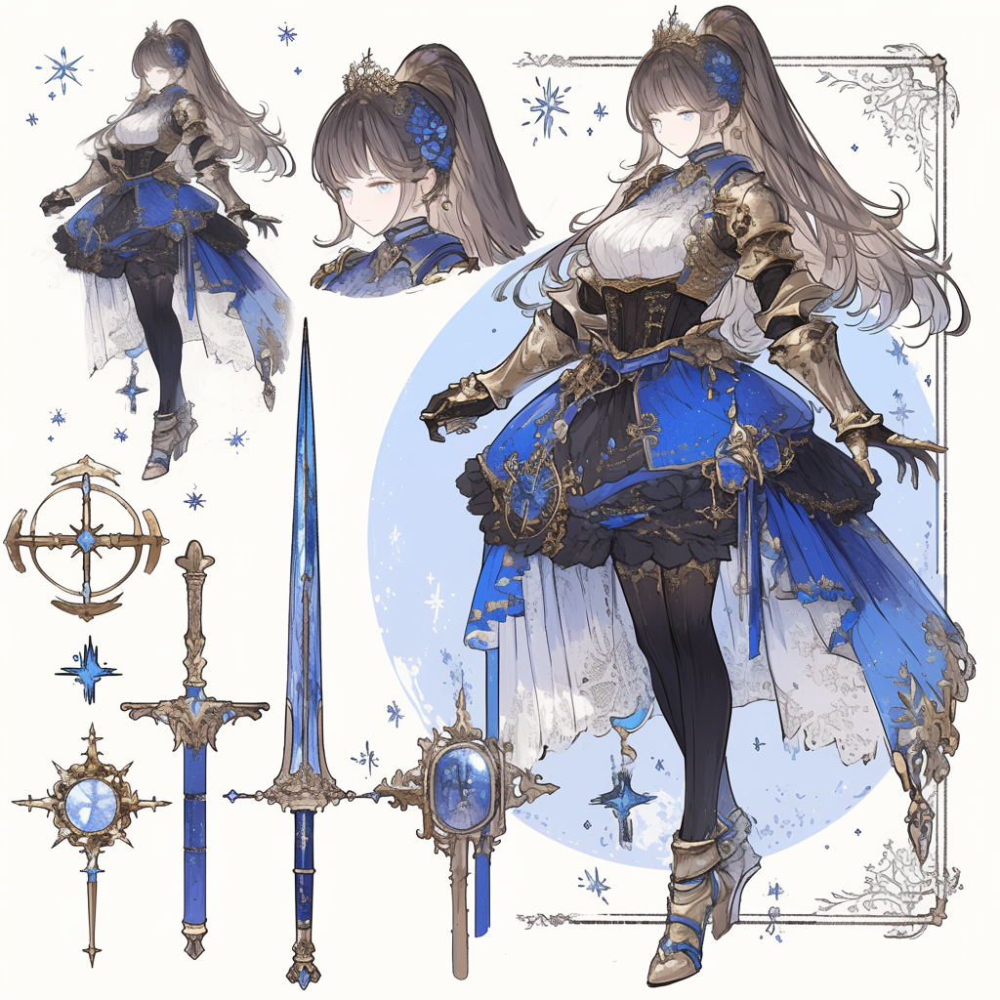

# Luna
Luna is the titular character of the game. She is a young, down-to-earth
woman and a skilled swordswoman and sorcerer. Officially, she is the Princess
of Entarya, however, she
was banished from her kingdom by her father, the king, leaving
her to fend for herself and find her own way in the world, and hopefully
prove herself and make her way back into the kingdom.

## Mechanics

Luna can equip both physical and magical weapons. She switches
between the two depending on the type of skill she uses.
To start, she only knows non-elemental magic, but she can
learn elemental magic as she progresses through the game.

## Experience and Levels

## Skills

Luna learns skills through the allocation of skill points, which
she earns through leveling up. She allocates these points into
skill trees, which are divided into physical and magical skills.
The trees are separate and can be developed independently, but a
skill point can only be put into one of the two trees.

By default, a basic sword attack is learned at level 1 and bound to the
Square button. This attack is a simple sword slash. Circle is used
to dash, and Triangle is used to cast a spell. Cross is jump.

### Physical Skills

* **Sword Slash** - A basic sword attack.
  * Lv.2: Adds a second slash to the combo.
  * Lv.3: Adds a third, powerful slash to the combo.

### Magic Spells

#### Non-elemental

* **Bolt** - Fires a bolt of energy forward.

#### Fire

* **Incinerate** - Continuous use. Engulfs the target/s in flames. Does damage over time.
  * Learned automatically once the Fire Spellbook is obtained.
  * Special use: Can be used to burn away thick ivy that blocks the path.
* **Flame Ward** - (Passive) Creates a shield of fire around Luna. Any enemy that touches the shield takes damage.
  * Lv.2: Increases the damage.
  * Lv.3: Increases the size.

#### Frost

* **Freeze** - Freezes the target/s in place. Continuous use; eventually freezes the target solid.
  * Learned automatically once the Frost Spellbook is obtained.
  * Special use: Can be used to freeze water to create platforms.
* **Blizzard** - A blizzard forms and damages all enemies on the screen while it lasts.
  * Lv.2: Increases the duration.
  * Lv.3: Increases the damage.

#### Fairy

* **Spark** - Lights up dark environments. Spark follows the player around until they exit the dark area.
  * Learned automatically once the Fairy Spellbook is obtained.
  * Special use: Can be used to light up dark areas. Gives access to dark dungeons.
* **Regen** - (Passive) Regenerates health over time.
  * Lv.2: Increases health regen
  * Lv.3: Also regens magic. (In addition to base mana regen.)