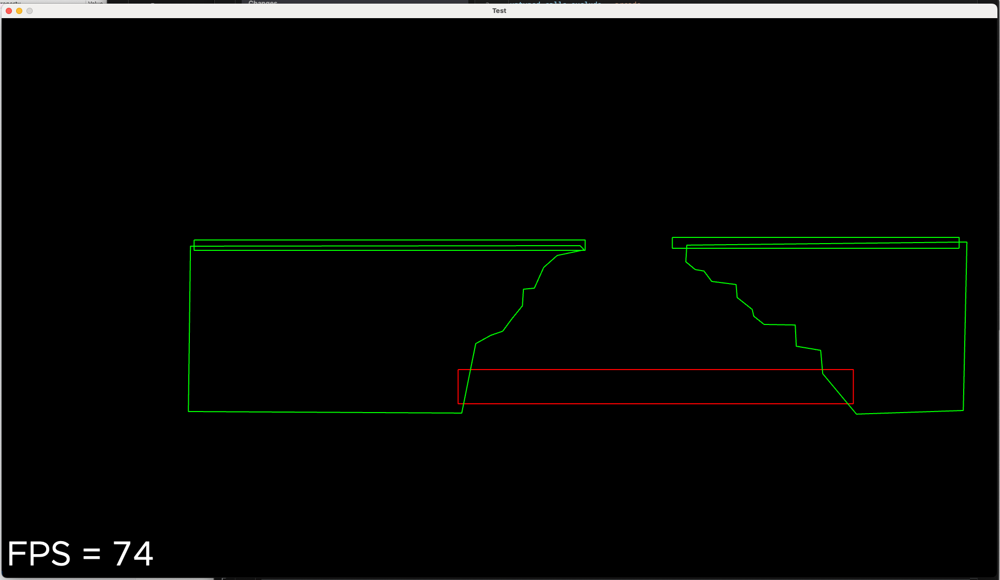

# Progress

## Collision Detection and Resolution
### 6/4/2024

I implemented a simple polygon collision detection and resolution algorithm and now Luna can jump up and down on
the ground. All map regions are triangulated now. 

## Gravity, texture drawing
### 6/2/2024

The background "tile" (it's just one huge map tile) is being drawn now.
You can't tell from this shot but rotation works too. Luna can jump and
fall, but there's no collision detection yet. The origin (0, 0) is drawn
as a red star in a white circle.

## Collision Geometry
### 5/31/2024

This screenshot shows the polygons loaded from the Tiled test map with the classes loaded (green = collision geometry, red = death zone).
The PlayView is using `Camera2D` now.